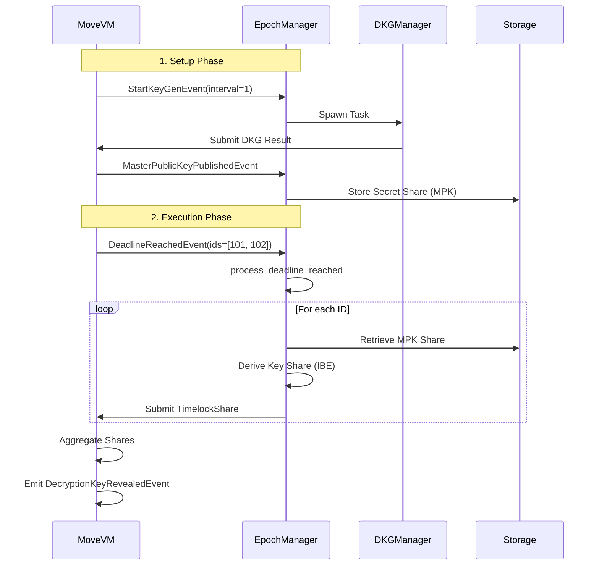

# Validator Event Subscription & Reaction Guide

This document details how the Atomica Timelock validators subscribe to, detect, and react to on-chain MoveVm events. It provides a comprehensive view of the event loop, specific handlers for the Timelock feature, and common "gotchas" for developers.

## 1. Architecture Overview

The Validator's event reaction logic is primarily hosted in the `EpochManager` struct within `dkg/src/epoch_manager.rs`. The `EpochManager` runs a main event loop that listens for notifications from the `EventNotificationListener`.

### The Event Loop

The `EpochManager::start` method kicks off the main loop:

```rust
pub async fn start(mut self, mut network_receivers: NetworkReceivers) {
    // ...
    loop {
        let handling_result = tokio::select! {
            notification = self.dkg_start_events.select_next_some() => {
                self.on_dkg_start_notification(notification)
            },
            // ... handles reconfig and networking ...
        };
        // ...
    }
}
```

This loop uses `tokio::select!` to multiplex between different event sources. Critical to the Timelock feature is the `dkg_start_events` channel, which despite its name, carries **all** DKG-related events subscribed to by the validator, including those for the Timelock registry.

## 2. Event Flow & Handlers

The `on_dkg_start_notification` function iterates through the batch of events received and dispatches them to specific handlers based on the event type (`type_tag`).

### A. Initialization: `StartKeyGenEvent`

When the `timelock` module initializes (or when a new DKG is required for the new epoch), it emits `StartKeyGenEvent`.

- **Move Trigger**: `emit(StartKeyGenEvent { epoch: 1, ... })`
- **Validator Reaction**: `EpochManager::start_timelock_dkg`
- **Action**:
  1.  Checks validator eligibility.
  2.  Spawns a new `DKGManager` task for the epoch.
  3.  Stores communication channels in `timelock_rpc_msg_txs`.

### B. Completion: `MasterPublicKeyPublishedEvent`

When the DKG completes and the `TimelockDKGResult` transaction is successfully executed, the Move module emits `MasterPublicKeyPublishedEvent` (mapped from `KeyPublishedEvent`).

- **Move Trigger**: Emitted after successful `timelock::publish_public_key`.
- **Validator Reaction**: `EpochManager::process_timelock_key_published`
- **Action**:
  1.  Deserializes the `master_public_key` (which contains the transcript).
  2.  Decrypts the validator's specific DK_share (Decryption Key Share) using its consensus key.
  3.  Persists the share to `PersistentSafetyStorage` (via `store_timelock_share`).
  4.  Cleans up the `DKGManager` task for this epoch.

### C. Execution: `DeadlineReachedEvent`

This is the core of the timelock model. When a registered timelock's deadline passes, the block prologue (`on_new_block`) emits this event.

- **Move Trigger**:
  ```move
  // timelock.move
  emit(DeadlineReachedEvent {
      deadline: next_deadline,
      timelock_ids: *ids,
  });
  ```
- **Validator Reaction**: `EpochManager::process_deadline_reached` calling `reveal_one_timelock`
- **Detailed Action**:
  1.  **Iterate**: Loops through all `timelock_ids` in the event.
  2.  **Fetch DK_share**: Retrieves the locally stored DK_share from the current epoch's DKG.
  3.  **Compute Identity**: Generates the IBE identity string: `timelock_id:{id}:deadline_timestamp_microseconds:{deadline}`.
  4.  **Derive Share**: Uses the DK_share to derive the decryption key share for this specific identity.
  5.  **Submit**: Sends a `ValidatorTransaction::TimelockShare` containing the share.

## 3. Data Flow Diagram



## 4. Common "Gotchas" & Misunderstandings

### Hashing & Serialization

- **Identity Format**: The exact string format for identity derivation is critical. It must match between TypeScript SDK and Rust Validator.
  - Format: `timelock_id:{id}:deadline_timestamp_microseconds:{deadline}`
- **BCS Serialization**: All complex types (Shares, Transcripts) are BCS serialized. Debugging failures often requires checking the exact byte layout.

### Hardcoded Epoch Reference

- The current implementation retrieves the DK_share from the current epoch's DKG output.
- _Note_: The code references the epoch number when storing/retrieving shares.

### Event Subscription Latency

- Validators process events asynchronously but generally very quickly. However, high network load could delay the `process_deadline_reached` handler. The system relies on `on_new_block` frequency.

### Dependency on Consensus Keys

- The DKG uses the validator's **Consensus Key** to encrypt the secret shares in the transcript. If a validator rotates their consensus key _during_ a DKG session, decryption of the share might fail if not handled correctly (though `EpochManager` snapshots state).

## 5. Review Findings

- **DKG per Epoch**: DKG runs at epoch boundaries, and the resulting MPK and DK_shares are used for all deadlines within that epoch.
- **Completeness**: The `process_deadline_reached` handler is fully implemented and correctly bridges the gap between the on-chain event and off-chain key derivation.
